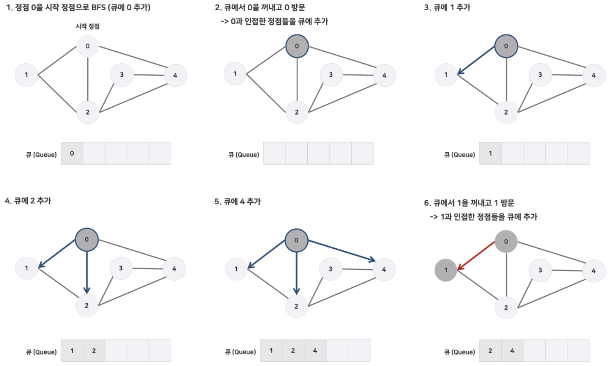
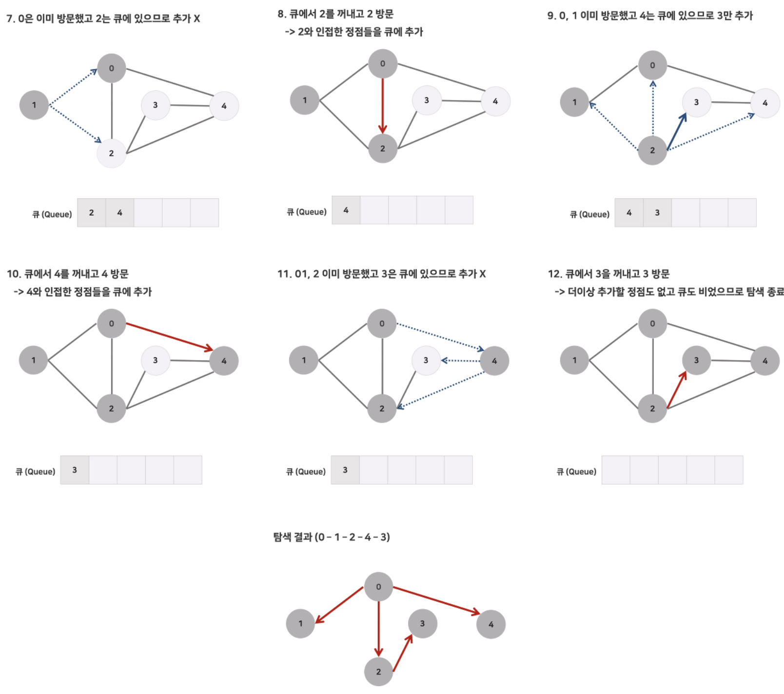

## 그래프 탐색(넓이 우선 탄샘 - BFS)

<br>

### BFS 넓이 우선 탑색(Breadth First Search)

<br>

`"꼼꼼하게 좌우를 살피며 다니자."` 와 같이 시작 정점으로부터 가까운 정점을 먼저 방문하고, 멀리 떨어져 있는 정점을 나중에 방문하는 알고리즘이다.   

시작 정점을 지나고 나면 깊이가 1인 모든 정점을 방문하고, 그다음에는 깊이가 2인 모든 정점을 방문한다.   

이런 식으로 한 단계씩 깊이를 더해가며 해당 깊이에 있는 모든 정점들을 방문해 나가다가 나중에는 더 이상 방문할 곳이 없을 때 탐색을 종료한다.   

- 루트 노트(혹은 다른 임의의 노드)에서 시작해서 인접한 노드를 먼저 탐색하는 방법   
- `사용하는경우`: `두 노드 사이의 최단 경로 혹은 임의의 경로를 찾고 싶을 때 이 방법을 선택한다.`  

<br>

### BFS의 특징

<br>

1. BFS는 시작 정점으로부터 거리가 가까운 정점의 순서로 탐색한다. (거리 1부터 2, 3 순서대로)   
2. 그래프 탐색의 경우 어떤 노드를 방문했었는지 여부를 반드시 검사해야 한다. (이를 검사하지 않을 경우 무한루프에 빠질 위험이 있다.)   
3. BFS는 재귀적으로 동작하지 않는다.   
4. BFS는 방문한 노드들을 차례로 저장한 후 꺼낼 수 있는 자료 구조인 큐(Queue)를 사용한다.   
    - 즉, 선입선출(FIFO) 원칙으로 탐색   
5. 일반적으로 큐를 이용해서 반복적 형태로 구현하는 것이 가장 잘 동작한다.   

<br>

### BFS의 수행 과정   

<br>   



<br>



<br>

1. a노드(시작 노드)를 방문한다. (방문한 노드 체크)   
   - 큐에 방문된 노드를 삽임(enqueue)한다.
   - 초기 상태의 큐에는 시작 노드만이 저장.   

2. 큐에서 꺼낸 노드와 인접한 노드들을 큐에 추가한다.(모두 차례로 방문)   
   - 큐에서 꺼낸 노드를 방문한다.   
   - 큐에서 꺼낸 노드와 인접한 노드들을 모두 방문한다.   
   - 인접한 노드가 없다면 큐의 앞에서 노드를 꺼낸다(dequeue).   
   - 큐에 방문된 노드를 삽입(enqueue)한다.   

3. 큐가 공백 상태가 될 때까지 계속한다.   

<br>

### BFS 구현 방법

<br>

큐(Queue)를 이용   

<br>

### 그래프 표현하기   

<br>

정점의 개수, 간선의 개수, 탐색을 시작할 정점을 번호로 입력받는다.   

노드 방문 여부를 검사하기 위한 boolean 배열도 선언한다.   

<br>

```Java
BufferedReader br = new BufferedReader(new InputStreamReader(System.in));
StringTokenizer st = new StringTokenizer(br.readLine());

int vertex = Integer.parseInt(st.nextToken());      // 정점의 개수
int edge = Integer.parseInt(st.nextToken());        // 간선의 개수
int startVertex = Integer.parseInt(st.nextToken())  // 탐색을 시작할 정점의 번호

boolean visited[] graph = new boolean[vertex + 1];   // 방문 여부를 검사할 배열
```

<br>

### BFS 인접 리스트로 구현

<br> 

```Java
List<Integer>[] list = new LinkedList[vertex + 1];

for (int i = 0; i <= vertex; i++) {
    list[i] = new LinkedList[vertex + 1];
}

// 두 정점 사이에 여러 개의 간선이 있을 수 있다.
// 입력으로 주어지는 간선은 양방향이다.

for (int i = 0; i < edge; i++) {
    int vertex01 = Integer.parseInt(st.nextToken());
    int vertex02 = Integer.parseInt(st.nextToken());
    
    graph[vertex01].add(vertex02);
    graph[vertex02].add(vertex01);
}

for (int i = 1; i <= vertex; i++) {
    Collections.sort(graph[i]);      // 방문 순서를 위해 오름차순 정렬
}

bfs_graph(startVertex, graph, visited);
```

<br>

처음 BFS 함수를 호출하면 int startVertex에 탐색을 시작할 정점의 번호가 들어가고, 이 시작 정점으로부터 탐색을 시작한다.   

큐를 생성하고 시작 정점 startVertex의 값을 Queue에 넣는다.   

1. 큐의 front에 있는 정점을 꺼낸다(poll), 이를 기준으로 간선이 연결되어 있고(인점하고), 아직 방문되지 않은 정점을 찾느다.   
2. 조건에 맞는 정점을 찾느다면 해당 정점을 방문했음으로 표시 후, Queue에 넣는다.   
   - Queue가 소진될 때까지 이를 반복하며 BFS를 수행하는 것이다.   

<br>

```Java
public static void bfs_graph(int startVertex, LinkedList<Integer>[] graph, boolean[] visited) {
    Queue<Integer> queue = new LinkedList<Integer>();
    visited[startVertex] = true;
    queue.add(startVertex);

    while (queue.size() != 0) {
        startVertex = queue.poll();
        System.out.println(startVertex + " ");

        Iterator<Integer> iterator = graph[startVertex].listIterator();

        while (iterator.hasNext()) {
            int nextVertex = iterator.next();
            if (!visited[nextVertex] {
                visited[nextVertex] = true;
                queue.add(nextVertex);
            })
        }
    }
}
```

<br>

### 전체 코드

<br>

```Java
import java.utii.*;
import java.io.*;

public class Main {

    static boolean[] visited;
    static List<Integer>[] graph;

    public static void main(String[] args) throws IOException {

        BufferedReader br = new BufferedReader(new InputStreamReader(System.in));
        StringTokenizer st = new StringTokenizer(br.readLine());

        int vertex = Integer.parseInt(st.nextToken());
        int edge = Integer.parseInt(st.nextToken());
        int startVertex = Integer.parseIne(st.nextToken());

        visited = new boolean[vertex + 1];
        graph = new LinkedList[vertex + 1];

        for (int i = 0; i <= vertex; i++) {
            graph[i] = new LinkedList<Integer>();
        }

        // 두 정점 사이에 여러 개의 간선이 있을 수 있다.
        // 입력으로 주어지는 간선은 양방향이다.
        while (edge-- > 0) {
            st = new StringTokenizer(br.readLine());

            int vertex01 = Integer.parseInt(st.nextToken());
            int vertex02 = Integer.parseInt(st.nextToken());

            graph[vertex01].add(vertex02);
            graph[vertex02].add(vertex01);
        }

        for (int i = 0; i <= graph.length; i++) {
            Collections.sort(graph[i]);     // 방문 순서를 위해 오름차순 정렬
        }

        System.out.println("BFS - 인접리스트");
        bfs_graph
    }

    static void bfs_graph(int startVertex, LinkedList<Integer>[] graph, boolean[] visited) {

        Queue<Integer> queue = new LinkedList<Integer>();
        visited[startVertex] = true;
        queue.add(startVertex);

        while (queue.size() != 0) {
            startVertex = queue.poll();
            
            System.out.println(startVertex + " ");

            Iterator<Integer> iteroatr = graph[startVertex].listIterator();
            while (iterator.hasNext()) {
                int nextVertex = iterator.next();
                if (!visited[nextVertex]) {
                    visited[nextVertex] = true;
                    queue.add(nextVertex);ß
                }
            }
        }
    }
}
```

<br>

입력   

<br>

```Java
5 5 3
5 4
5 2
1 2
3 4
3 1
```

<br>

출력   

<br>

```Java
BFS - 인접리스트
3 1 4 2 5
```


