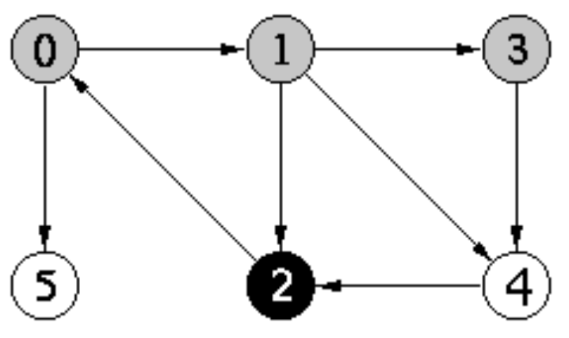
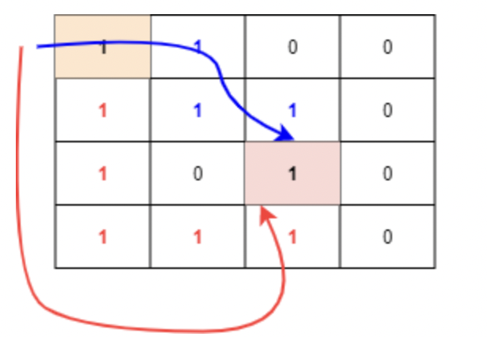

# 그래프 탐색(깊이 우선 탄샘 - DFS)

<br>

### 1. 깊이 우선 탑색(DFS, Depth First Search)

깊이 우선 탐색을 가장 쉽게 비교할 수 있는 것은 `트리(Tree) 구조의 순회(in/pre/post Order)`이다.

그래프도 비슷한 방식으로 동작한다고 보면 되는데, 최초 시작 정점에서 가장 먼저 이어져 있는(간선으로 연결된) 정점을 하나 찾고 해당 정점에 또 인접한 정점을 찾아 더 이상 깊이 갈 수 없을 때까지 탐색한 뒤 돌아오는 방식이다.   

트리와의 큰 차이점은, `그래프는 순환(Cycle)할 수 있다`는 것이다. 그래서, `순환 탐지(Cycle Detection)`를 할 수 있도록 추가적인 기능을 구현해야 한다는 것이다.   

BFS와의 큰 차이점은, DFS는 탐색을 한 뒤 이전의 정점으로 돌아온다는 것이다. 이것을 `백트래킹(Backtracking)`이라고 한다. 이것을 이용하여 다양한 문제에 활용할 수 있다.   

<br>



<br>

① 그림으로 알아보기   

<br>

위의 그림을 보면 0번에서 1, 2로 이동한 뒤 2에서 더 이상 깊이 갈 수 없어 2를 탐색 완료 후, 1로 돌아온다.   
다시 1에서 3, 4로 더 깊이 들어갔다가 나오는 방식을 반혹한다.   

말 그대로, 깊이 들어갔다가 나오는 방식을 반복한다.   

<br>

② DFS를 사용하는 예시

<br>

그래프의 순환이 있는지 확인하는 경우 많이 쓰인다. BFS로도 가능하지만 DFS가 더 메모리 효율적이다. 기타 경로 찾기, 위상 정렬, 미로 찾기 등등 다향한 예시에서 사용될 수 있다.   

하지만 최단 경로를 찾을 떄는 BFS를 기반으로 탐색해야 한다... BFS는 최단 경로를 즉각적으로 보장해주면서 탐색을 할 수 있지만 DFS는 그렇지 못한 경우가 있기 때문이다.   

아래 예시를 살펴보자.   

<br>



<br>

만약 우리가 주확색으로 칠해진 곳에서 빨간색으로 칠해진 곳으로 가고자 한다고 할 떄, 유일한 경로는 파란 화살표와 빨간 화살표가 있을 수 있다.(다른 것도 가능하지만 대표적으로...)   

그럼 BFS로 탐색을 하면 빨간 부분, 파란 부분 인접 정점을 동시에 차례 대로 탐색을 하게 되며 시작점이 고정이라서 무조건 모든 인접 정점이 최소의 경우로만 이동하도록 보장이 된다.   

그래서 `BFS`로 탐색 시, 원하는 위치에 도달했다면 추가 탐색을 그만두어 빠르게 문제를 해결할 수 있게 된다.  

그런데 `DFS`로 탐색하면, 상단의 빨간색 부분 부터 우선 탐색이 이루어질 수 있다. 하지만 이 경로는 최소 경로라는 보장이 불가능하다! 실제 위의 예시에서는 최소 경로가 아니다.   

보장을 하기 위해서는 이미 방문한 경로의 정점을 미 방문 상태로 전환하고 다른 모든 동일 위치에 도달할 수 있는 경우를 체크해야 하는데, 그것은 DFS가 아니다 Brute Force 방법이 된다. 그러면 문제를 푸는데, 시간 복잡도가높아져 문제를 풀 수 없게 된다.   

(DFS, BFS는 기본적으로 이미 방문한 정점을 다시 방문하지 않아야 한다!!!!)   

<br>

③ 구현 방법

<br>

`스택 또는 재귀 방식`을 이용하여 구현할 수 있다.   

`스택은 FILO(First-In, Last-Out) 방식`이기 때문에 인접한 정점이 우선이 아닌 더 멀리 있는(인접 정점의 끝) 정점을 우선 탐색한 뒤 돌아올 수 있다. 큐는 FIFO라서 인접 정점을 우선하여 탐색하므로 쓸 수 없다. 큐는 BFS에서 사용   

재쉬 방식으로 진행하는 것 또한 가능다하. 재귀 자체가 내부적으로 Stack을 사용하는 방식이기 떄문이다.  

둘 중에선 `재귀 방식이 더 많이 쓰인다. 더운 구현이 간단하기 때문이다.`   

<br>

④ 코드

<br>

```Java
import java.util.Iterator;
import java.util.LinkedList;
import java.util.Stack;

public class Graph {
    public static void main(String[] args) {

        Graph g = new Graph(6);

        g.addEdge(0, 1);  // 0 -> 1 연결
        g.addEdge(0, 5);  // 0 -> 5 연결
        g.addEdge(1, 2);  // 1 -> 2 연결
        g.addEdge(1, 3);  // 1 -> 3 연결
        g.addEdge(1, 4);  // 1 -> 4 연결
        g.addEdge(2, 0);  // 2 -> 0 연결
        g.addEdge(3, 4);  // 3 -> 4 연결
        g.addEdge(4, 2);  // 4 -> 2 연결

        g.dfs();
    }

    private int v;  // 정점의 개수
    private LinkedList<Integer> adj[];  // 인접 리스트

    public Graph(int v) {
        this.v = v;
        this.adj = new LinkedList[v];

        for (int i = 0; i < v; i++) {
            adj[i] = new LinkedList<>();
        }
    }
}
```
