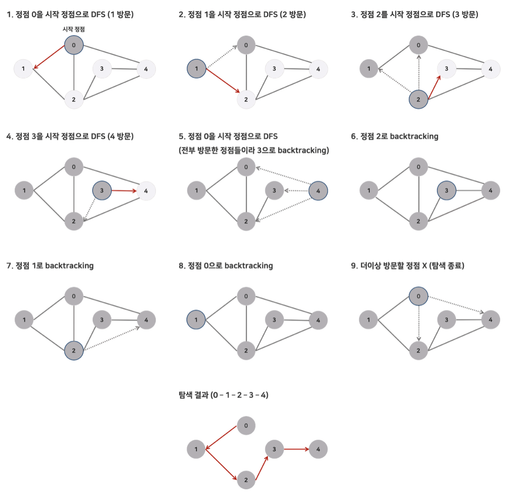

## 그래프 탐색(깊이 우선 탄샘 - DFS)

 

### DFS 깊이 우선 탑색(Depth First Search)

 

`"더 나아갈 길이 보이지 않을 때까지 깊이 들어간다."` 를 원칙으로 그래프 내의 정점을 방문하는 알고리즘이다.   

미로 찾기처럼 그래프의 정점을 타고 깊이 들어가다 더 이상 방문해왔던 정점 말고는 다른 이웃을 갖고 있지 않은 정점을 만나면, 뒤로 돌아와 다른 경로로 뻗어있는 정점을 타고 방문을 재개하는 방식으로 동작한다.   

루트 노트(혹은 다른 임의의 노드)에서 시작해서 다음 분기(branch)로 넘어가기 전에 해당 분기를 완벽하게 탑색하는 방법     

> 사용하는 경우: 모든 노드를 방문하고자 하는 경우에 이 방법을 선택한다.(완전 탐색 알고리즘에 자주 이용됨.)   

 

### DFS의 특징   

1. 자기 자신을 호출하는 순환 알고리즘의 형태   
2. 트리 순회(전위, 중위, 후위 순회)는 모두 DFS의 한 종류   
3. 그래프 탐색의 경우 어떤 노드를 방문했었는지의 여부를 반드시 검사해야함(안하면 무한루프에 빠질 위험이 있음)   

 

### DFS의 수행 과정

 

 

1. a노드(시작 노드)를 방문한다.
   - 방문한 노드는 방문했다고 표시한다.   

2. a와 인접한 노드들을 차례로 순회한다.   
   - a와 인접한 노드가 없다면 종료한다.   

3. a와 이웃한 노드 b를 방문했다면, a와 인접한 또 다른 노드를 방문하기 전에 b의 이웃 노드들을 전부 방문해야 한다.   
   - b를 시작 정점으로 DFS를 다시 시작하여 b의 이웃 노드들을 방문한다.(단계 1 다시)   

4. b의 분기를 전부 완벽하게 탐색했다면 다시 a에 인접한 정점들 중에서 아직 방문이 안된 정점을 찾는다.   
   - 즉, b의 분기를 전부 완벽하게 탐색한 뒤에야 a의 다른 이웃 노드를 방문한 수 있다는 뜻이다.   
   - 아직 방문이 안된 정점이 없으면 종료한다.   
   - 있으면 다시 그 정점을 시작 정점으로 DFS를 시작한다.    
