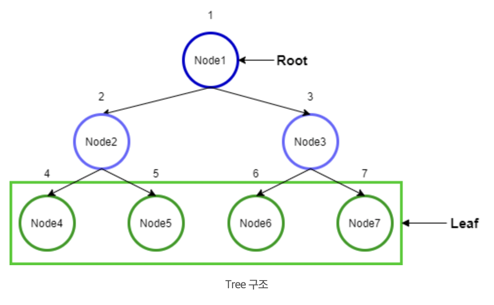
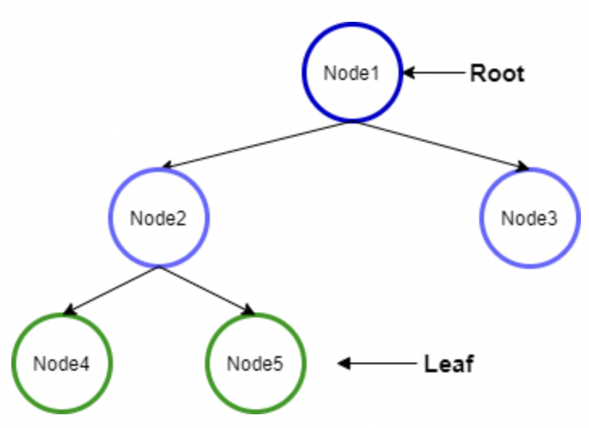
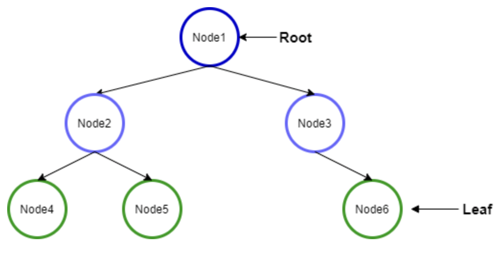
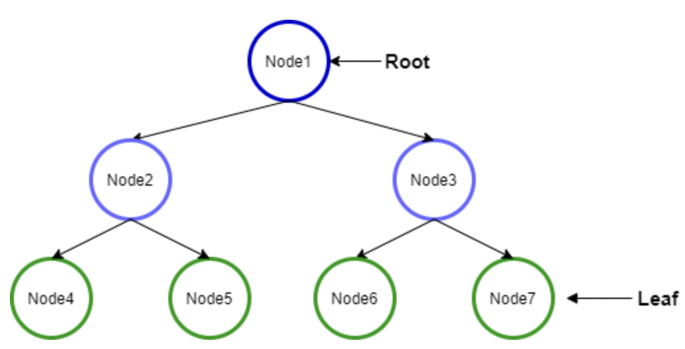

# 트리(Tree), 이진 트리(Binary Tree)

<br>

### 1. 트리(Tree)란?   

<br>

자바의 Collection Framework `ArrayList, LinkedList, Map, Stack, Queue`의 자료구조들은 기본적으로 `선형(Linear)자료 구조`라는 공통점이 있다.(Map은 조금 다르지만...)   

선형(Linear) 자료 구조란 무언인가? 구조에 저장될 데이터들이 `순차적으로 저장되는 형태`를 의미한다.   
간단히 배열을 생각해보면 메모리 공간에 순서대로 나열해서 저장하는 것을 알 수 있다.     


ArrayList는 배열을 기반으로 하며, LinkedList는 배열은 아니지만 데이터를 저장한 노드들이 선형으로 이어진 형태인 것이다.   
Stack, Queue 또한 이러한 구조를 바탕으로 설계되었다.   


Tree 구조는 `비-선형(Non-Linear) 자료 구조`이다. 이러한 구조는 단일 방향으로 각각의 데이터들이 연결되거나 나열된 것이 아니라 `복수의 데이터들이 복수의 데이터들과 연결될 수 있는 구조`로 설계 될 수 있다.   

<br>

* 선형 구조와 비-선형 구조의 차이   

    |Point|선형 구조|비-선형 구조|
    |---|---|---|
    |데이터 저장|순차적으로 각 데이터를 순회할 수 있도록 저장|데이터들이 계층적으로 연결되어 저장|
    |수준(Level)|단일 수준(Level)에서 모든 데이터를 저장|복수 수준(Level)에서 데이터를 저장|
    |구현 복잡도|구현이 쉬움|구현이 어렵고 이해도 난해|
    |순회|단일 동작으로 모든 데이터 순차적 순회 가능|데이터 순회에 복수의 동작 필요|
    |메모리 활용|메모리 공간 효율성 낮음|메모리 공간을 매루 효율적으로 활용|
    |시간 복잡도|저장 공간이 늘어나면 비례하여 증가|저장 공간이 늘어나면 비례하는 수준보다 적게 증가|   

<br>

선형 구조와 비-선형 구조는 그 쓰임새도 다르고 공간을 활용하는 방법과 데이터를 찾는 시간적 복잡도에서도 차이가 있으며, 알고리즘 중 BFS/DFS와 같은 문제를 푸는 경우 비-선형 구조의 형태를 많이 활용 한다.   


`Tree`를 이해하기 가장 쉬운 구조는 집안의 계보이다. 조상님부터 대대로 내려오는 계보를 보면 어떠한 구조로 집안 내력이 형성되어 있는지를 명료하게 알 수 있을 것이다.  
누가 어느 집안 사람인지, 몇 번째 자식인지 등등...   

<br>



<br>

위 그림은 대표적인 `Tree` 형태의 구조를 의미한다. 각각의 노드가 있고 이 노드들이 각각 2개의 노드와 연결되어 있다. 이러한 구조를 `이진 트리(Binary Tree)` 라고 한다.   

<br>

* 정의

    |이름|설명|위 그림 기반 예시|
    |---|---|---|
    |Root|Tree 구조의 최상단 Node|Node1|
    |Edge|Node와 Node의 연결|화살표|
    |Parent|Leaf Node 제외한 모든 Node Edge로 연결된 Node를 하위에 보유한 모든 Node|Node1 ~ 3|
    |Child|Root Node를 제외한 모든 Node 즉, Parent를 갖는 Node|Node2 ~ 7|
    |Leaf|Tree의 구조에서 Child를 갖지 않는 모든 최하단 Node|Node4 ~ 7|
    |Heigth|전체 Tree 구조에서 가장 긴 경로|Root - Leaf 모든 경로가 2의 거리(경로)|
    |Depth|특정 Node에서 Root Node 까지의 경로(깊이)|Node3은 Root 까지 1의 Depth|
    |Sub Tree|Tree 구조 내에 있는 모든 부분적인 Tree|Node2와 그 아래는 전체 Tree의 Sub Tree|
    |Sibling|동일한 Parent/Level 갖는 관계인 Node|Node2, Node3은 Sibling|

<br>

트리의 Depth(깊이)는 루트를 0으로 두거나 1로 두는 경우가 있다. 반드시 정해진 것은 아니다.   

추가로, 조상(Ancestor), 자손(Descendent)도 있는데 이는 정점 A에서 정점 B사이를 루트를 경유하지 않고 위 혹은 아래 방향으로 한 방향으로만 이동이 가능할 때, A가 루트에 더 가깝다면 A를 조상, B를 자손이라고 부른다.   

조상은 자기 자신을 포함하여 간주하기 때문에 자기 자신도 스스로의 조상이 된다고 본다.   

`Tree`라고 하면 위의 구조를 쉽게 떠올리게 되는데, 반드시 위처럼 Child가 2개인 이진 트리만 있는 것은 아니다.  
Child를 몇개를 가지든 위와 같은 형태의 구조를 통해 형성된다면 `Tree`구조라 볼 수 있다.   

참고로 트리는 그래프의 일종이다.   


<br>
<br>
<br>

---

### 2.이진 트리

<br>

여러 형태의 트리 구조가 있겠지만 여기서는 이진 트리에 대해서 깊이 들여다 본다. 이진 트리는 트리 구조의 자료 형태 중에서도 가장 많이 쓰인다. 이 구조를 여러 가지 방법을 활용해 개량하여 필요에 따라 사용할 수 있다.   

이진 트리는 `각 노드가 Child 노드를 최대 2개씩 보유한 형태`를 의히한다. 각 노드는 Left/Right Child 노드라고 명명해서 부른다.   

그렇다면 이진 트리를 자바로 직접 구현해본다. 우선 최초의 빈 상태라면 제일 먼저 넣은 노트를 Root로 가져가야 할 것이다.   

* ① 완전 이진 트리 / 포화 이진 트리    
  이진 트리는 위의 그림와 같은데 그중에서도 완정 이진 트리(Complete Binary Tree)와 포화 이진 트리(Perfect Binary Tree)가 있다.   

  완전 이진 트리는 위 층위부터 시작하여 왼쪽에서 오른쪽 방향으로 모든 노드가 차 있는 경우를 의미한다.   
  포화 이진 트리는 Leaf 노드가 있는 층위까지 모든 노드가 다 꽉 차이있는 상태를 의미한다.   

  <br>

  

  <br>

  위 그림은 완전 이진 트리이다. 위 층위부터 아래 층위로 가면서 왼쪽부터 차곡차곡 쌓여 있기 때문이다.   

  <br>

  

  <br>

  위 그림은 그냥 이진 트리일 뿐, 완전 이진 트리가 아니다. 왜냐하면 Node3의 자식이 좌측부터 채워지지 않았기 때문이다.   

  <br>

  

  <br>

  위 그림은 포화 이진 트리의 그림이다. 모든 층위에 노드가 꽉 차있기 때문이다.   

  이는 완전 이진트리이기도 하다. 포화 이진 트리는 반드시 완전 이진 트리이지만 완전 이진 트리가 반드시 포화 이진 트리는 아니다.   

<br>

* ② 트리 표현하는 방법   
  
트리를 구현하는 방법은 기본적으로 3가지 있다.   

(1) 트리는 기본적으로 그래프 형태의 구조이다. 따라서 `그래프의 인접 리스트 방식으로 쉽게 표현이 가능`하다.   
(2) `배열로 표현`하기 - 이 경우는 `완전 이진 트리만 가능`하다.   
  - 루트 노드를 index 1로 표현하고 좌측 자식을 x2, 우측 자식을 x2 + 1의 index에 넣어서 저장하면 된다.   
  - Heap, 세그먼트 트리 구현 시 많이 쓰인다.   
(3) `별도의 class(구조화)로 구성`하는 방법이 있다.   

<br>
<br>
<br>

---

## 3.이진 트리(Binary Tree) 구현하기   

<br>

① Node 클래스   
- Node class는 LinkedList의 노드러첨 자체적으로 데이터 값을 저장하고 있으며 각 Parent/Child 노드에 대한 정보도 갖고 있어야 한다. 따라서 아래와 같이 구현될 수 있다.   

    <br>

    ```Java
    class Node<T> {
        T value;
        Node left;
        Node right;

        public Node(T value) {
            this.value = value;
        }
    }
    ```

    <br>

② Binary Tree 클래스
- Binary Tree 클래스는 전체 이진 트리에 대한 정보를 갖고 있는 클래스이다. 따라서, 현재 Root 노드가 무엇인지, 현재 저장된 노드의 수는 몇 개인지 등의 정보를 갖는다.   

    <br>

    ```Java
    public class BinaryTree<T> {
        Node<T> root = null;
        int size = 0;

        public BinaryTree(){};
    }
    ```

<br>

③ 데이터 노드 삽입하기
- 데이터 삽입은 `최초에 Root가 비어 있다면 Root에 담고, 아니라면 Root의 Left부터 차곡차곡 데이터를 삽입`하는 방식으로 진행한다.   
- 이 방식을 유지하려면 `레벨 순회`가 가능해야 한다. 순회란 Tree 구조에서 저장된 모든 데이터를 빼내는 방식에 대해 정의를 의미한다. 

    <br>

    ```Java
    public boolean insert(T value) {
        Node newNode = new Node(value);
        if (size == 0) {
            root = newNode;

            return true;
        }

        Queue<Node<T>> q = new LinkedList<>();
        q.add(root);

        while (true) {
            Node tmp = q.peek();
            if (tmp.left == null) {
                tmp.left = newNode;
                newNode,parent = tmp;
                
                break;
            } else {
                q.add(tmp.left);
            }

            if (tmp.right == null) {
                tmp.right = newNode;
                newNode.parent = tmp;

                break;
            } else {
                q.add(tmp.right);
            }
        }

        return true;
    }
    ```


   


